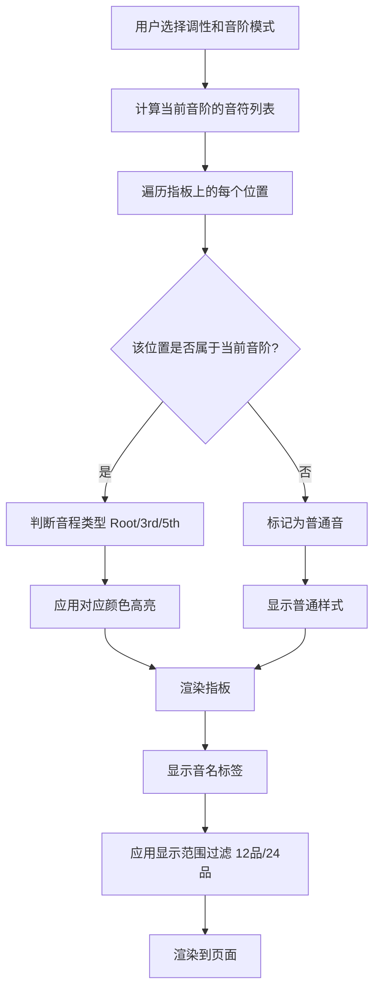
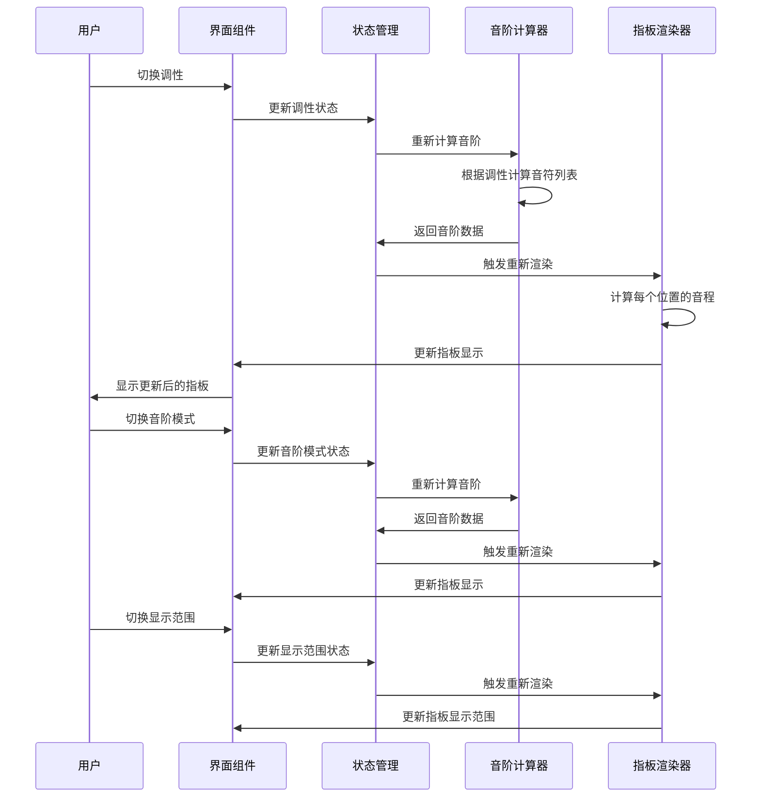

# 吉他音阶图查看器 - 产品需求文档 (PRD)

## 一、产品路线图 (Product Roadmap)

### 核心目标 (Mission)
为吉他手提供便捷的在线音阶图查看工具，帮助练习时快速查看不同调性和音阶模式下的指板音程分布。

### 用户画像 (Persona)
- **目标用户**：吉他手（初学者到进阶）
- **核心痛点**：
  - 练琴时需要查看音阶图，纸质资料不便携带和查找
  - 需要快速切换不同调性和音阶模式进行练习
  - 需要清晰看到 Root、3rd、5th 等关键音程在指板上的位置
  - 需要看到音名以便理解音阶构成

### V1: 最小可行产品 (MVP)
1. **横向布局的24品、6弦吉他指板可视化**
2. **12个调性切换**（C、C#、D、D#、E、F、F#、G、G#、A、A#、B）
3. **2种音阶模式切换**（自然大调音阶、五声音阶）
4. **音程高亮显示**（Root、3rd、5th），颜色区分
5. **显示音名标签**（C、D、E、F、G、A、B，含升降号）
6. **桌面端响应式布局**
7. **调性和音阶模式切换控件**
8. **显示范围切换**：12品模式 / 24品模式
9. **横向滚动条**：24品模式下可滚动查看全部

### V2 及以后版本 (Future Releases)
1. 可自定义显示的音程（开关控制，支持 2nd、4th、6th、7th、b7 等）
2. 更多音阶模式（Dorian、Phrygian、Lydian、Mixolydian、Locrian 等教会调式）
3. 点击指板播放音（Web Audio API）
4. 指法建议显示
5. 7/8 弦吉他支持
6. 保存常用配置（LocalStorage）
7. 分享功能（生成链接）
8. 指板缩放功能（适应不同屏幕）
9. 暗色/亮色主题切换
10. 音阶公式显示（如：1-2-3-4-5-6-7）

### 关键业务逻辑 (Business Rules)
1. **调性切换**：12个调性循环切换，影响所有音名的显示
2. **音阶模式切换**：
   - **自然大调音阶**：1-2-3-4-5-6-7（全全半全全全半）
   - **五声音阶**：1-2-3-5-6（全全小三全）
3. **音程计算**：
   - **Root**：音阶的根音
   - **3rd**：音阶的第3个音
   - **5th**：音阶的第5个音
4. **颜色映射**：
   - **Root**：红色系
   - **3rd**：蓝色系
   - **5th**：绿色系
5. **音名显示**：所有指板上的音都显示音名，但只有符合当前音阶的音会被高亮
6. **显示范围逻辑**：
   - **12品模式**：默认显示前12品，每品较大，易读
   - **24品模式**：显示全部24品，每品较小，支持横向滚动查看

### 数据契约 (Data Contract)
1. **调性数据**：12个调性枚举（C、C#、D、D#、E、F、F#、G、G#、A、A#、B）
2. **音阶模式数据**：
   - **自然大调音阶**：音程间隔 [2, 2, 1, 2, 2, 2, 1]（半音数）
   - **五声音阶**：音程间隔 [2, 2, 3, 2, 3]（半音数）
3. **指板数据**：
   - 6根弦，每根弦的开放音（E、A、D、G、B、E）
   - 24品，每品半音递增
4. **音程映射**：每个音在指板上的位置 → 音名 → 是否属于当前音阶 → 音程类型（Root/3rd/5th）

---

## 二、MVP 原型设计与确认

### 选定的原型图：原型图 1（经典横向布局）

```
┌─────────────────────────────────────────────────────────────┐
│  吉他音阶图查看器                                    [主题切换] │
├─────────────────────────────────────────────────────────────┤
│                                                               │
│  调性: [C ▼]    音阶模式: [自然大调音阶 ▼]   显示范围: [12品 ▼] │
│                                                               │
│  ┌─────────────────────────────────────────────────────┐   │
│  │                                                       │   │
│  │  E ──[F]──[F#]──[G]──[G#]──[A]──[A#]──[B]──[C]──... │   │
│  │  B ──[C]──[C#]──[D]──[D#]──[E]──[F]──[F#]──[G]──... │   │
│  │  G ──[G#]──[A]──[A#]──[B]──[C]──[C#]──[D]──[D#]──... │   │
│  │  D ──[D#]──[E]──[F]──[F#]──[G]──[G#]──[A]──[A#]──... │   │
│  │  A ──[A#]──[B]──[C]──[C#]──[D]──[D#]──[E]──[F]──... │   │
│  │  E ──[F]──[F#]──[G]──[G#]──[A]──[A#]──[B]──[C]──... │   │
│  │                                                       │   │
│  │  0   1    2    3    4    5    6    7    8    ...     │   │
│  │                                                       │   │
│  │  [◄ 滚动查看 13-24品 ►]                               │   │
│  └─────────────────────────────────────────────────────┘   │
│                                                               │
│  图例: [●] Root (红色)  [●] 3rd (蓝色)  [●] 5th (绿色)      │
│                                                               │
│  当前音阶: C 自然大调音阶                                     │
│  音阶构成: C - D - E - F - G - A - B                         │
└─────────────────────────────────────────────────────────────┘
```

### 设计说明
- **布局结构**：参考图片风格，顶部控制区，横向指板居中，底部信息区
- **控制区**：调性、音阶模式、显示范围切换按钮
- **指板区域**：横向显示，6根弦从上到下，24品从左到右
- **显示范围**：12品/24品切换，24品模式支持横向滚动
- **音程高亮**：Root（红色）、3rd（蓝色）、5th（绿色）
- **信息区**：图例、当前音阶、音阶构成

---

## 三、架构设计蓝图

### 3.1 核心流程图

#### 3.1.1 音阶计算与指板渲染流程



#### 3.1.2 用户交互流程



### 3.2 组件交互说明

#### 3.2.1 组件架构

```
┌─────────────────────────────────────────┐
│           App (主应用组件)                │
├─────────────────────────────────────────┤
│  ┌───────────────────────────────────┐  │
│  │    Header (顶部控制区)              │  │
│  │  - KeySelector (调性选择器)         │  │
│  │  - ScaleModeSelector (音阶模式选择) │  │
│  │  - DisplayRangeSelector (显示范围)  │  │
│  └───────────────────────────────────┘  │
│  ┌───────────────────────────────────┐  │
│  │    Fretboard (指板组件)            │  │
│  │  - FretboardGrid (指板网格)         │  │
│  │  - NoteCell (音符单元格)            │  │
│  │  - ScrollContainer (滚动容器)       │  │
│  └───────────────────────────────────┘  │
│  ┌───────────────────────────────────┐  │
│  │    Footer (底部信息区)              │  │
│  │  - Legend (图例)                   │  │
│  │  - ScaleInfo (音阶信息)             │  │
│  └───────────────────────────────────┘  │
└─────────────────────────────────────────┘
         │
         ▼
┌─────────────────────────────────────────┐
│       State Management (状态管理)        │
│  - currentKey (当前调性)                 │
│  - currentScaleMode (当前音阶模式)       │
│  - displayRange (显示范围)               │
│  - scaleNotes (当前音阶音符列表)         │
└─────────────────────────────────────────┘
         │
         ▼
┌─────────────────────────────────────────┐
│      Business Logic (业务逻辑层)         │
│  - ScaleCalculator (音阶计算器)          │
│  - IntervalCalculator (音程计算器)       │
│  - NoteMapper (音名映射器)               │
└─────────────────────────────────────────┘
```

#### 3.2.2 组件调用关系

1. **App 组件**
   - 管理全局状态（调性、音阶模式、显示范围）
   - 渲染 Header、Fretboard、Footer 组件
   - 处理状态变化并传递给子组件

2. **Header 组件**
   - 包含 KeySelector、ScaleModeSelector、DisplayRangeSelector
   - 用户操作触发状态更新，通过 props 回调传递给 App

3. **Fretboard 组件**
   - 接收当前调性、音阶模式、显示范围作为 props
   - 调用 ScaleCalculator 计算音阶
   - 调用 IntervalCalculator 计算每个位置的音程
   - 渲染 FretboardGrid，包含多个 NoteCell

4. **NoteCell 组件**
   - 接收位置信息（弦、品）、音名、音程类型
   - 根据音程类型应用对应颜色样式
   - 显示音名标签

5. **Footer 组件**
   - 显示图例和当前音阶信息
   - 接收当前音阶数据作为 props

#### 3.2.3 数据流

```
用户操作
  ↓
Header 组件触发事件
  ↓
App 组件更新状态
  ↓
状态传递给 Fretboard 组件
  ↓
Fretboard 调用业务逻辑层计算
  ↓
业务逻辑层返回计算结果
  ↓
Fretboard 渲染指板
  ↓
Footer 显示音阶信息
```

### 3.3 技术选型与风险

#### 3.3.1 技术选型

**前端框架**
- **推荐**：React + TypeScript
- **理由**：组件化开发，类型安全，生态丰富
- **备选**：Vue 3 + TypeScript

**状态管理**
- **推荐**：React Hooks (useState, useMemo)
- **理由**：MVP 阶段状态简单，无需复杂状态管理库
- **V2 考虑**：如需复杂状态，可引入 Zustand 或 Redux

**样式方案**
- **推荐**：CSS Modules 或 Tailwind CSS
- **理由**：样式隔离，易于维护
- **备选**：Styled Components

**构建工具**
- **推荐**：Vite
- **理由**：快速开发，热更新，构建优化

**音阶计算算法**
- **实现方式**：纯 JavaScript 算法
- **核心逻辑**：
  - 根据调性确定根音
  - 根据音阶模式计算音程间隔
  - 生成音阶音符列表
  - 映射到指板位置

**指板渲染**
- **实现方式**：CSS Grid 或 Flexbox
- **理由**：响应式布局，易于控制间距和对齐

#### 3.3.2 潜在技术风险

1. **性能风险**
   - **风险**：24品指板渲染大量 DOM 节点可能影响性能
   - **缓解**：
     - 使用虚拟滚动（仅渲染可见区域）
     - 使用 useMemo 缓存计算结果
     - 优化重渲染逻辑

2. **音阶计算准确性**
   - **风险**：音阶计算逻辑错误导致显示错误
   - **缓解**：
     - 编写单元测试覆盖所有调性和音阶模式
     - 使用已知的音阶数据作为测试用例

3. **响应式布局**
   - **风险**：不同屏幕尺寸下指板显示异常
   - **缓解**：
     - 使用 CSS Grid/Flexbox 实现响应式
     - 在不同屏幕尺寸下测试
     - 考虑最小宽度限制

4. **浏览器兼容性**
   - **风险**：某些浏览器不支持新特性
   - **缓解**：
     - 使用 Babel 转译
     - 使用 Autoprefixer 处理 CSS 前缀
     - 测试主流浏览器（Chrome、Firefox、Safari、Edge）

5. **滚动体验**
   - **风险**：24品模式下横向滚动体验不佳
   - **缓解**：
     - 使用平滑滚动
     - 提供滚动条指示
     - 考虑分页或缩放功能

#### 3.3.3 开发建议

1. **开发顺序**
   - 先实现音阶计算逻辑（核心业务逻辑）
   - 再实现指板渲染（UI 层）
   - 最后优化交互和样式

2. **测试策略**
   - 单元测试：音阶计算器、音程计算器
   - 集成测试：组件交互
   - 手动测试：不同调性和音阶模式组合

3. **代码组织**
   - 按功能模块组织代码
   - 分离业务逻辑和 UI 组件
   - 使用 TypeScript 定义清晰的类型

---

## 四、最终确认

### 4.1 需求锁定
- ✅ 横向指板布局
- ✅ 24品指板（支持12品/24品切换）
- ✅ 6弦吉他
- ✅ 12个调性切换
- ✅ 2种音阶模式（自然大调、五声音阶）
- ✅ Root、3rd、5th 音程高亮
- ✅ 显示音名标签
- ✅ 桌面端响应式布局
- ✅ 原型图1（经典横向布局）

### 4.2 下一步行动
1. 搭建项目框架（React + TypeScript + Vite）
2. 实现音阶计算核心逻辑
3. 实现指板渲染组件
4. 实现交互功能（调性、音阶模式切换）
5. 实现显示范围切换和滚动功能
6. 样式优化和响应式适配
7. 测试和优化

---

**文档版本**：v1.0  
**最后更新**：2025年  
**状态**：已确认，待开发

